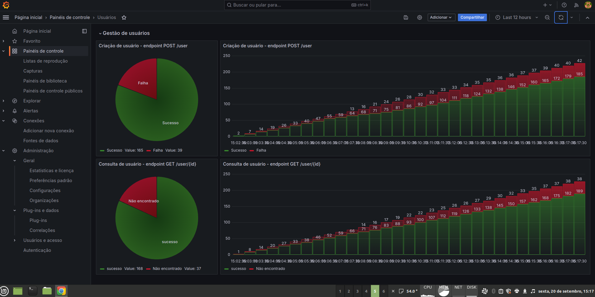

# Monitorando sua aplicanção em Golang com Prometheus e Grafana



[Artigo](https://medium.com/@alcbotta/monitoring-you-golang-server-with-prometheus-and-grafana-97e64bb1d0e9)

Aplicação simples onde é usado Proetheus para coletar inforações da aplicação e usar o Grafana para visualizar as inforações coletadas,
neste exemplo há um container server simulando requisições para o endpoint de consulta e criação de usuário, para que as metrilas desses serviços sejam armazenados no **Prometeus** e exibidos no **Grafana**.

## Como rodas a apliação
```sh ./run.sh ```

Remove todos os containers e sobre eles denovo com base no arquivo **docker-compose.yml** e exibe os logs do container **server**

### Prometheus
URL: [http://localhost:9090/tsdb-status](http://localhost:9090/tsdb-status)
Localhost para ser configurado na fonte de dados no Graphana: 
```sh prometheus:9090```

### Graphana 
URL: [http://localhost:3000](http://localhost:3000)

Para configurar host do prometheus, no host configurar: ```sh http://prometheus:9090 ```

